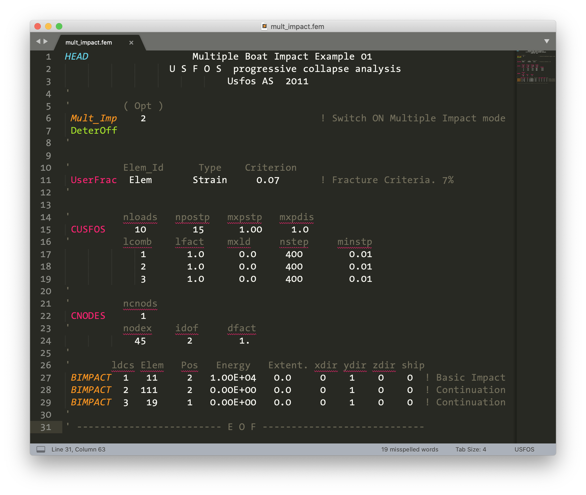

# USFOS syntax highlighting for Sublime Text

[USFOS] is a super efficient commercial computer software for performing non-linear static and dynamic analysis of space frame structures.

The syntax file `usfos.sublime-syntax` included in this repository [color codes][s] the various parameters used in USFOS input files (with `.fem` extension) to help break the monotony of text and improve readability of input file(s). It works with [Sublime Text 3][st] in MacOS, Windows 10, or Linux. Below is an example of a syntax highlighted control file:

## Installation

### From package control (recommended)

With this package now available from [Package Control][pkg] `usfos_st` can be installed from directly within Sublime Text 3. Here is how:

1. From _Tools_, select _Install Package Control..._ (skip step if installed)
2. From _Preferences > Package Control > Install Package_, search for `usfos` and select

### Manual method

Download and place the file `usfos.sublime-syntax` under _Packages > User_ folder, which is accessible from _Preferences > Browse Packages..._ menu.

[USFOS]: https://usfos.com/ "USFOS - Reality Engineering"
[s]: https://en.wikipedia.org/wiki/Syntax_highlighting "Syntax highlighting"
[st]: https://www.sublimetext.com/ "Sublime Text - A sophisticated text editor for code, markup and prose"
[pkg]: https://packagecontrol.io/packages/USFOS
